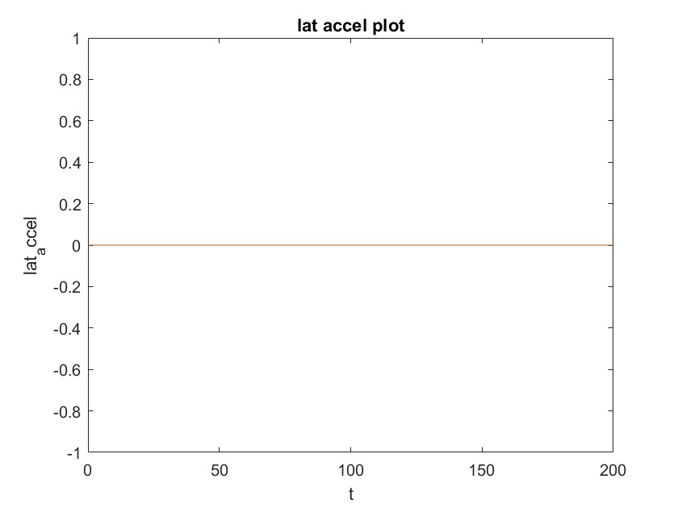

Markdown does not directly support CSS or inline styling like HTML. To arrange images in a grid-like format (e.g., 2 graphs per row), we can use a table layout. Here's how you can structure your README to achieve that:

---

# Velocity Control on 4-Wheel Driveline Model with PID Controller

## Case Studies

### Case 1 Torque in = 225 NM and Steering angle = 0 rad/s  
| **Longitudinal Velocity** | **Lateral Velocity** |
|---------------------------|-----------------------|
|  |  |

| **Pose (2D)**             | **Lateral Acceleration** |
|---------------------------|---------------------------|
|  |  |

---

### Case 2 Torque in = 450 NM and Steering angle = 0 rad/s
| **Longitudinal Velocity** | **Lateral Velocity** |
|---------------------------|-----------------------|
|  |  |

| **Pose (2D)**             | **Lateral Acceleration** |
|---------------------------|---------------------------|
|  |  |

---

### Case 3 Torque in = 100 NM and Steering angle = 0.1 rad/s
| **Longitudinal Velocity** | **Lateral Velocity** |
|---------------------------|-----------------------|
|  |  |

| **Pose (2D)**             | **Lateral Acceleration** |
|---------------------------|---------------------------|
|  |  |

---
### Case 3 Torque in = 100 NM and Steering angle = 0.1 rad/s Left Turn
| **Longitudinal Velocity** | **Lateral Velocity** |
|---------------------------|-----------------------|
|  |  |

| **Pose (2D)**             | **Lateral Acceleration** |
|---------------------------|---------------------------|
|  |  |

---

## PID Tuning
| **PID Tuning - Graph 1** | **PID Tuning - Graph 2** |
|--------------------------|--------------------------|
|  |  |

---

This approach aligns images into a grid without relying on HTML-specific styling, ensuring compatibility with Markdown viewers such as GitHub. Replace `path/to/...` with the actual paths to your images.
